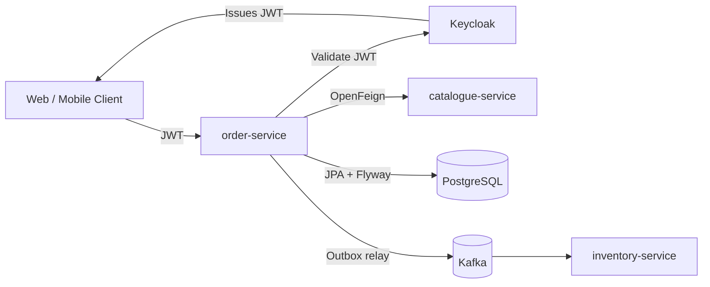
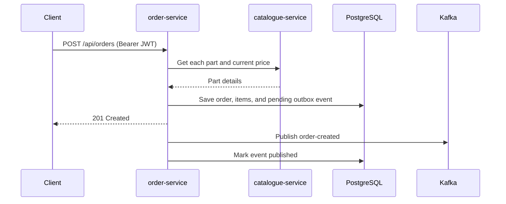
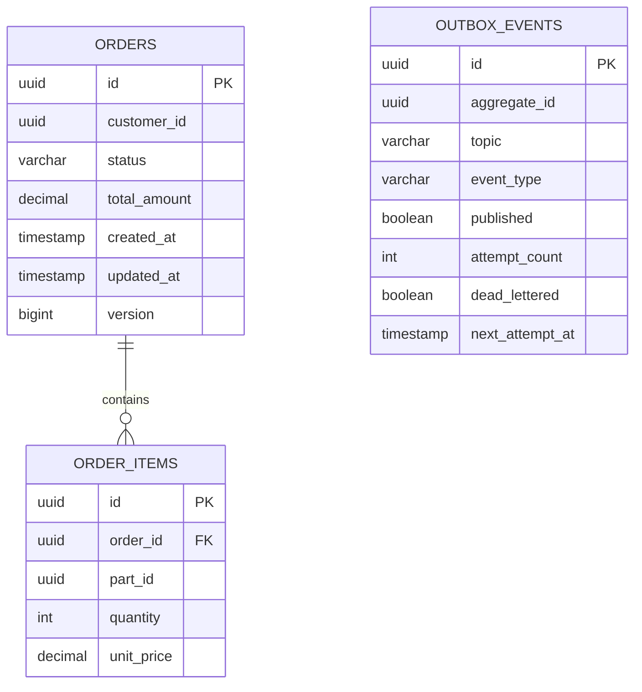
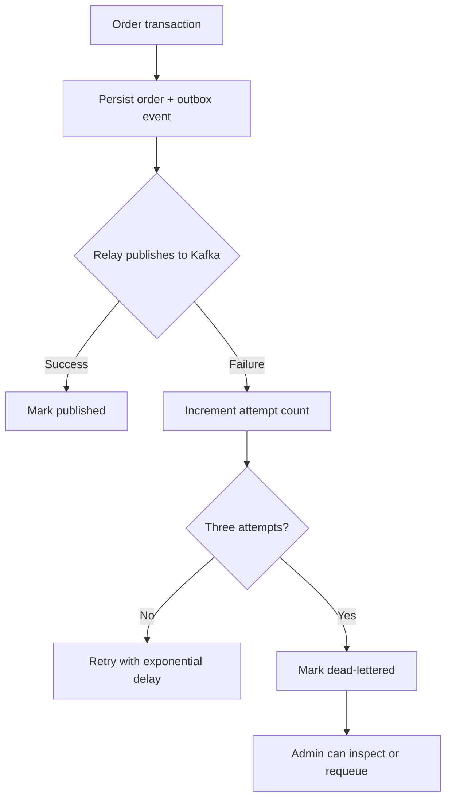
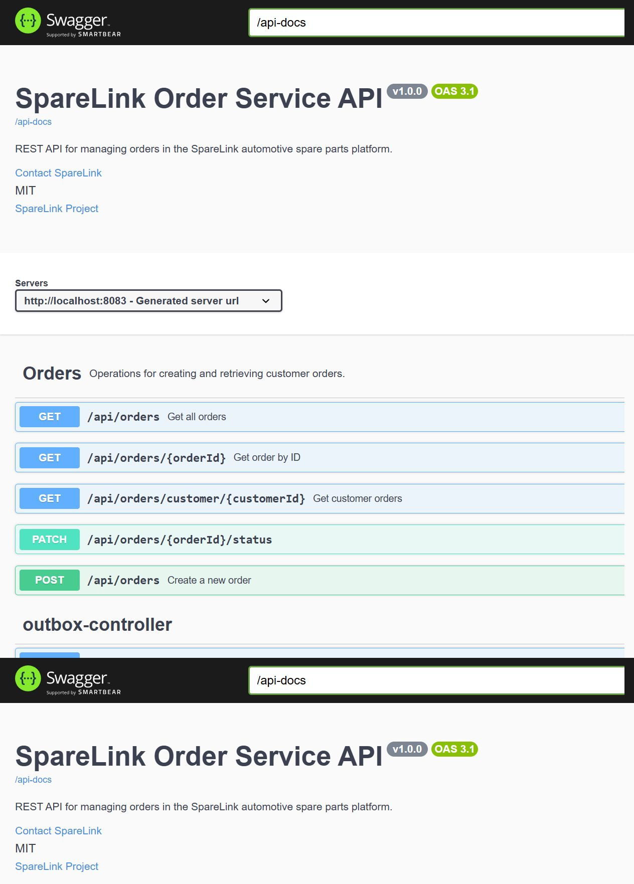

# SpareLink Order Service

[](https://github.com/tadiwanashe-mashongwa/order-service/actions/workflows/ci.yml)
[](https://github.com/tadiwanashe-mashongwa/order-service/actions/workflows/ci.yml)
[](https://openjdk.org/projects/jdk/21/)
[](https://spring.io/projects/spring-boot)

Order management microservice for **SpareLink**, an automotive spare-parts platform. It creates customer orders from catalogue prices, persists them safely, publishes lifecycle events through an outbox, and protects APIs with Keycloak JWT roles.

## Highlights

- Java 21, Spring Boot 3.5.5, PostgreSQL, Flyway, JPA/Hibernate
- OpenFeign catalogue integration with mapped 404/503 failures
- Transactional outbox, Kafka publishing, retry backoff, dead-letter and requeue support
- Keycloak JWT security with `CUSTOMER` and `ADMIN` roles
- OpenAPI/Swagger, Actuator, Docker Compose
- Testcontainers for PostgreSQL and Kafka; WireMock for Feign integration

## Architecture



## Order creation flow



## Database model



## Local run

```bash
docker compose up -d --build
```

Services:

| Service | URL |
|---|---|
| Order API | `http://localhost:8083` |
| Swagger UI | `http://localhost:8083/swagger-ui.html` |
| Health | `http://localhost:8083/actuator/health` |
| Keycloak | `http://localhost:8080` |

The local Keycloak realm is `sparelink`, with development users `customer` / `customer` and `admin` / `admin`. These credentials are strictly for local development.

## API and access control

| Endpoint | CUSTOMER | ADMIN |
|---|---:|---:|
| `POST /api/orders` | Own customer ID only | Yes |
| `GET /api/orders/{id}` | Own order only | Yes |
| `GET /api/orders/customer/{customerId}` | Own customer ID only | Yes |
| `GET /api/orders` | No | Yes |
| `PATCH /api/orders/{id}/status` | No | Yes |
| `/api/outbox/**` | No | Yes |

Health and OpenAPI endpoints are public. Send a Keycloak bearer token for API calls.

## Reliability: transactional outbox



## Testing strategy

The test suite follows TDD and uses the smallest realistic test layer for each behaviour:

| Layer | Scope |
|---|---|
| Unit | Domain transitions, outbox retry/dead-letter, services, security rules |
| MVC slice | Validation, HTTP problems, pagination, JWT role/ownership access |
| JPA slice | PostgreSQL repository queries and outbox due-event selection |
| Integration | Real Spring context, PostgreSQL/Kafka Testcontainers, Flyway |
| Feign integration | WireMock catalogue responses and mapped failures |

Run everything locally:

```bash
.\mvnw.cmd test
```

The JaCoCo HTML report is generated at `target/site/jacoco/index.html`.

## API screenshots

Swagger UI from the running secured service:



## Project structure

```text
src/main/java/com/example/orderservice
├── controller      HTTP API
├── service         application use cases
├── entity          order domain model
├── outbox          reliable event delivery
├── client          catalogue Feign client
├── config          security and OpenAPI configuration
└── exception       ProblemDetail error handling
```
